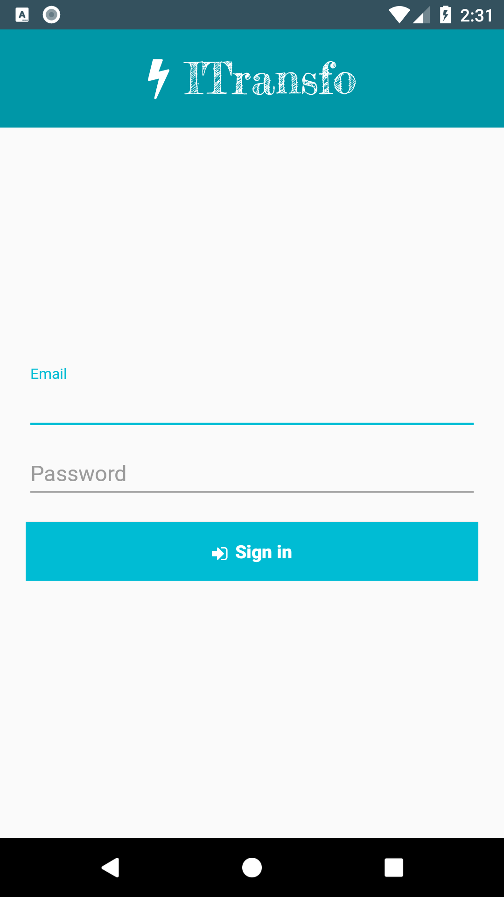
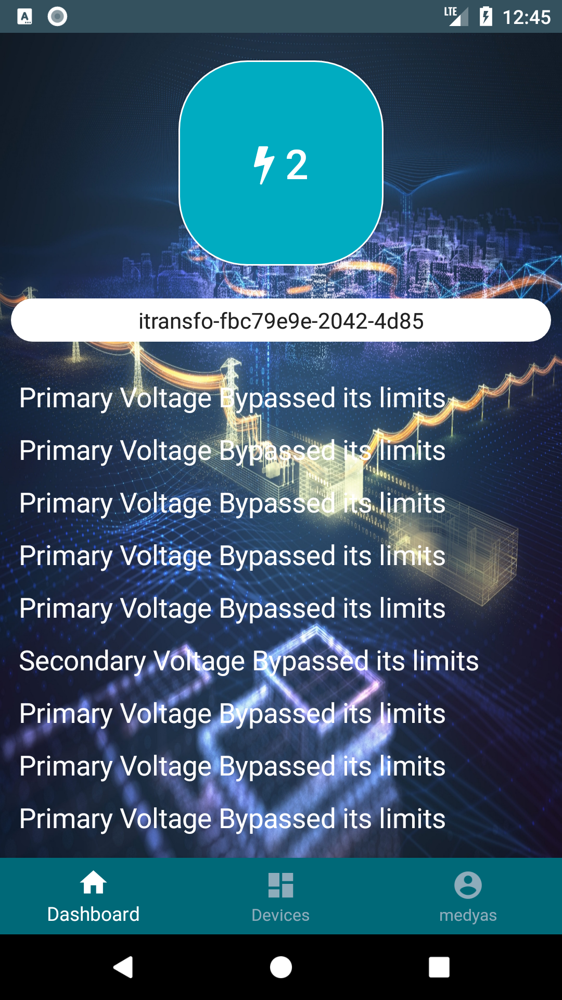
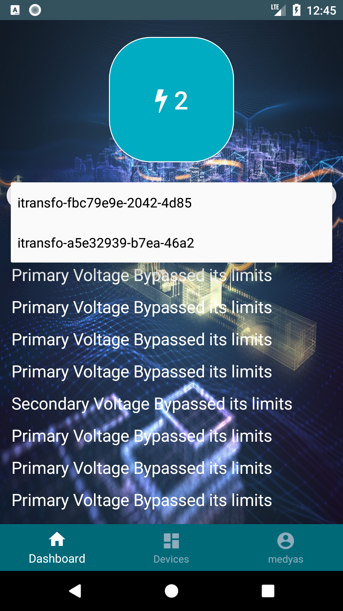
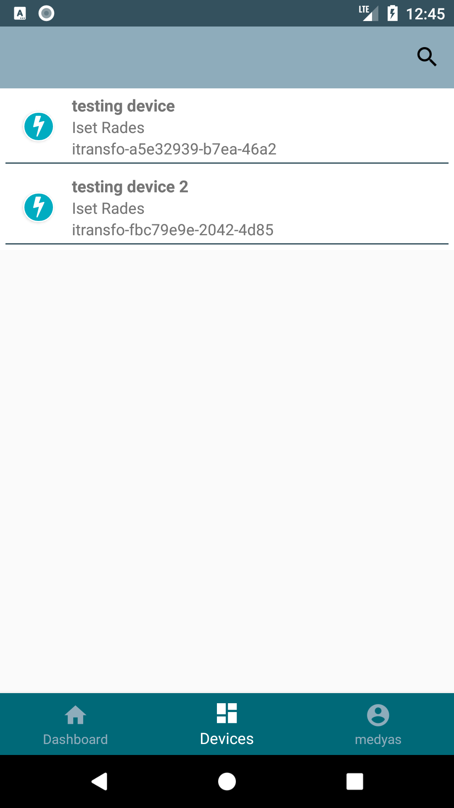
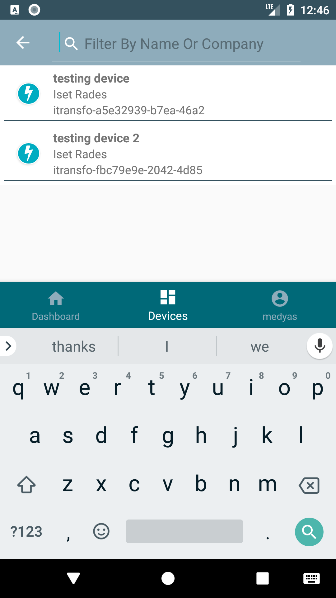
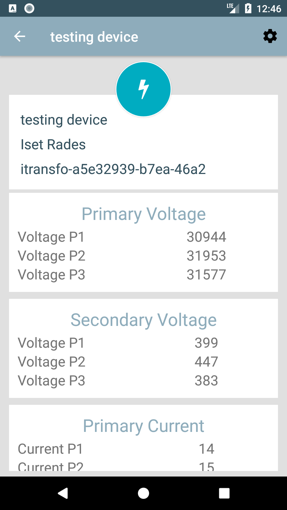
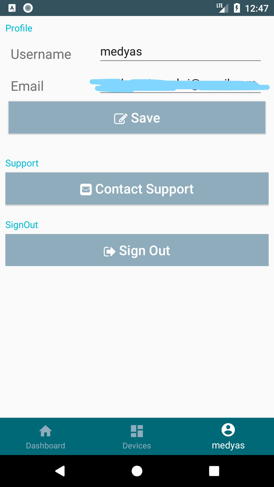

# ITransfo Android App

## Info:

This app is part of an IOT system [ITransfo App](https://itransfo.tk/) that allows monitoring of a high voltage transformer in real time. the monitored information include: voltage, current, gas and temperature.
Also, based on the inputed limits in the web interface, the app will receive notification if any of the monitored values bypasses the limits.
The app communicates with a Firebase and AWS serves to retrive the saved data and allow the monitoring of the transformer status.
This app is solely written in Kotlin and XML. 

[**Demo App Video**](https://drive.google.com/open?id=1UboFw44ON_v2ghh2Ssp1tWov6eYaBfH2)

Login interface

main app interface

List of user devices - display error messages

List of user devices

Ability to filter the devices

Latest selected device data - updated each 5seconds

Settings interface - alter user data
